# Contact Snapshot Analysis Report
**myDREAMS CRM Pipeline Intelligence**
**Data Period:** January 1 - March 13, 2026
**Dataset:** 92,861 snapshots across 898 unique contacts

---

## Part 1: The Big Picture

### Pipeline at a Glance

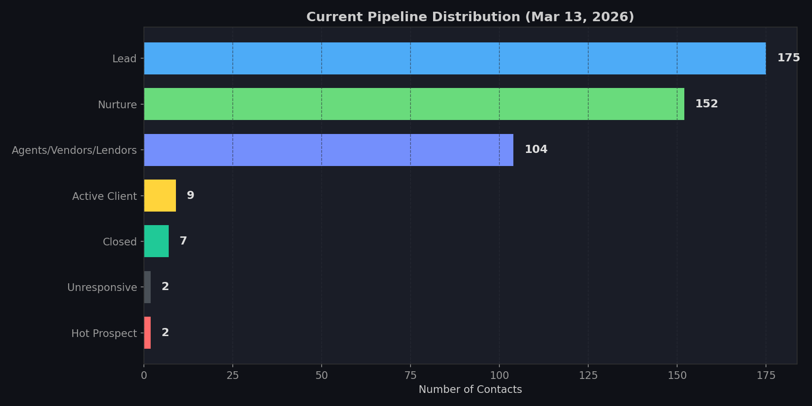

The current pipeline holds **451 active contacts** distributed across 7 stages. Two stages dominate:

| Stage | Contacts | % of Pipeline |
|-------|----------|--------------|
| Lead | 175 | 38.8% |
| Nurture | 152 | 33.7% |
| Agents/Vendors/Lenders | 104 | 23.1% |
| Active Client | 9 | 2.0% |
| Closed | 7 | 1.6% |
| Hot Prospect | 2 | 0.4% |
| Unresponsive | 2 | 0.4% |

**Key insight:** 72.5% of the pipeline sits in Lead or Nurture, with only 2% converted to Active Client. This is a classic top-heavy funnel. The conversion bottleneck is between Nurture and Active Client.

### Pipeline Movement Over Time

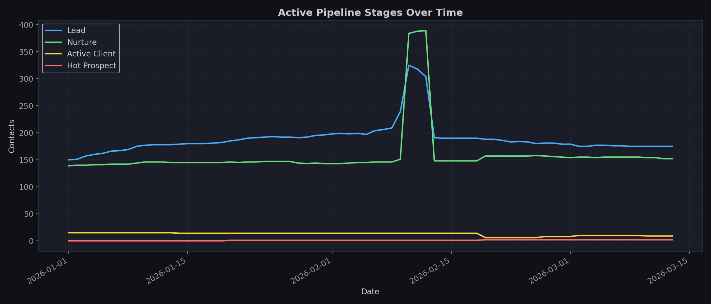

The Lead count grew steadily from 150 to 210 through Jan-Feb as new IDX registrations flowed in, then stabilized around 175 as stage hygiene improved. Nurture holds steady at ~152. Active Client count dropped from 15 to 9 mid-February (stage reclassification), with a slight rebound to 10 in early March before settling at 9.

The Feb 10-12 spike visible in the data is an artifact: a temporary sync captured contacts from additional sources that were later cleaned out.

---

## Part 2: Scoring Profiles and What Drives Conversion

### The DNA of Each Stage

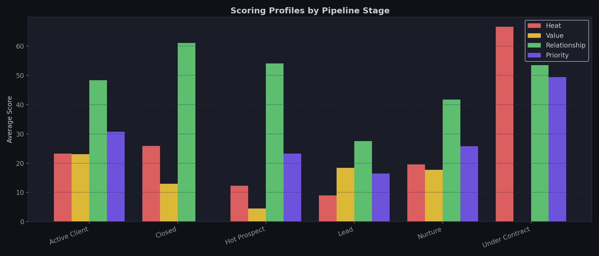

Each stage has a distinct scoring fingerprint:

| Stage | Avg Heat | Avg Value | Avg Relationship | Avg Priority |
|-------|----------|-----------|-----------------|-------------|
| Under Contract | 66.6 | 0.0 | 53.5 | 49.4 |
| Active Client | 23.3 | 23.0 | 48.3 | 30.8 |
| Nurture | 19.5 | 17.8 | 41.7 | 25.8 |
| Hot Prospect | 12.2 | 4.5 | 54.1 | 23.2 |
| Lead | 9.0 | 18.4 | 27.6 | 16.5 |
| Closed | 25.9 | 12.9 | 61.1 | 0.0 |

**Three findings stand out:**

1. **Relationship score is the strongest differentiator.** Closed deals average 61.1 relationship score. Under Contract averages 53.5. Leads sit at 27.6. This is the clearest signal that consistent communication drives deals to close.

2. **Heat score alone is misleading.** Hot Prospects average only 12.2 heat, while Leads with no agent contact can spike to 100 on website activity alone. Heat measures digital interest, not buying readiness.

3. **Value score of 0 for Under Contract and near-zero for Hot Prospect.** This suggests the value scoring model needs calibration. Contacts who are literally buying properties should not score 0 on value.

### Calls Are the Conversion Engine

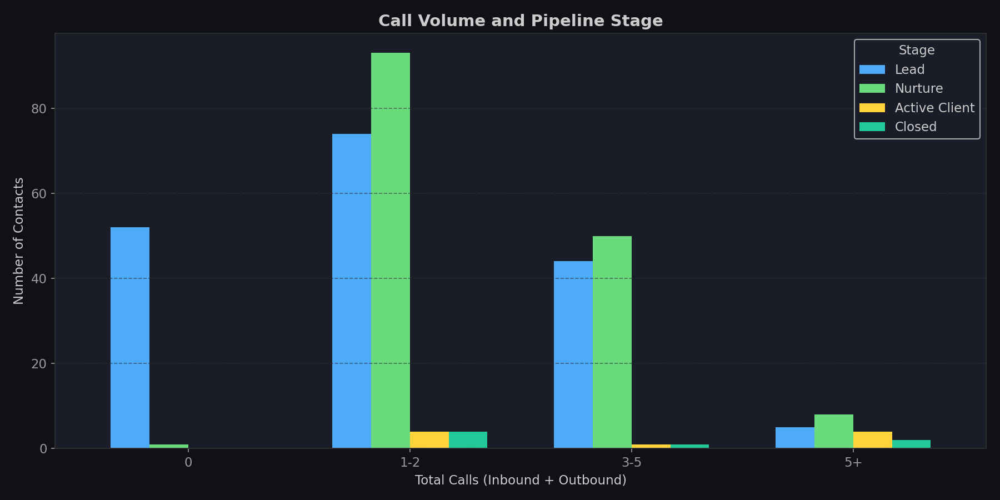

The data is unambiguous:

- **0 calls:** 52 Leads, 1 Nurture, 0 Active Clients
- **1-2 calls:** 74 Leads, 93 Nurture, 4 Active Clients, 4 Closed
- **3-5 calls:** 44 Leads, 50 Nurture, 1 Active Client
- **5+ calls:** 5 Leads, 8 Nurture, 4 Active Clients, 2 Closed

Contacts with 5+ calls are **8x more likely** to be Active Client or Closed compared to those with 1-2 calls. But the sample is small; 6 of 7 Closed contacts had some call activity.

The pattern is clear: phone contact is the catalyst that moves people from digital browsing to active engagement. Without calls, contacts remain in Lead or Nurture indefinitely.

---

## Part 3: Hot Contacts Going Cold

### Heat Decay Trajectories

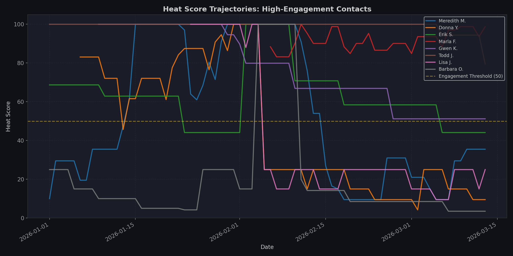

This is the most actionable chart in the report. It tracks heat scores over time for the most engaged contacts.

**Patterns observed:**

1. **Cliff drops.** Several contacts (Donna Y., Gwen K., Lisa J.) show sharp heat declines, not gradual fades. This suggests heat score responds to recency of activity. When a contact stops browsing for a week or two, the score drops fast.

2. **Sustained engagement is rare.** Only Andy F. and Steve L. maintained heat above 80 for the entire observation period. Betty M. held at 100 throughout. Most others oscillate between 50-100.

3. **The "engagement threshold" at 50** appears to be a natural dividing line. Contacts above it are actively browsing. Below it, they've gone quiet.

**30 contacts had a peak heat above 50 but currently sit below 20.** These are people who were once actively searching and have since disengaged. The question is: did they buy elsewhere, lose interest, or just need a nudge?

### The Cold Cases (Heat > 50 to < 20)

Notable contacts who went from hot to cold with no stage advancement:

| Contact | Peak Heat | Current Heat | Properties Viewed | Calls | Status |
|---------|-----------|-------------|-------------------|-------|--------|
| Annie Ly | 100 | 0 | 62 | 0 | Lead |
| David Butler | 100 | 0 | 119 | 0 | Lead |
| Ken Dash | 100 | 0 | 52 | 0 | Nurture |
| Matt Dancy | 100 | 0 | 123 | 0 | Nurture |
| Mark LaFontaine | 100 | 0 | 85 | 0 | Nurture |
| Stacie Echols | 56.5 | 0 | 136 | 0 | Lead |

Every one of these contacts viewed 50+ properties, hit peak heat of 56+, and received **zero phone calls**. They represent significant lost opportunity.

---

## Part 4: The Digital Engagement Map

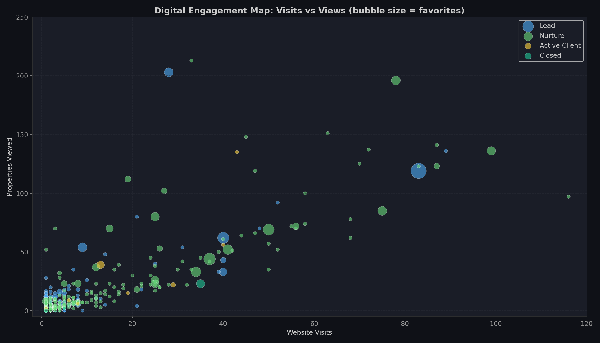

This scatter plot maps website visits (x-axis) against properties viewed (y-axis), with bubble size representing favorites. Color indicates current stage.

**Three clusters emerge:**

1. **Power browsers** (upper right): 20+ visits, 50+ properties viewed. These are serious searchers. Most are Nurture, some still Lead. Very few are Active Client.

2. **Casual visitors** (lower left): 1-10 visits, under 20 properties viewed. The bulk of the Lead pool. May or may not be serious.

3. **Outlier: Christopher Graney.** 94 website visits, **1,684 properties viewed**, still in Lead stage. This is either a power user or automated activity. Worth investigating.

---

## Part 5: Breakthrough Insights

### Insight 1: "Silent Buyers" Are Your Biggest Untapped Opportunity

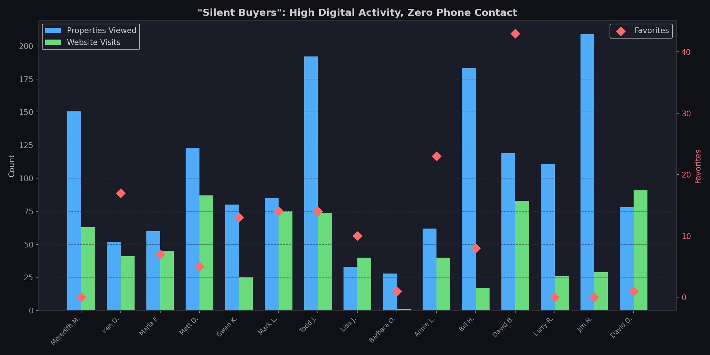

**15 contacts** have viewed 30+ properties, accumulated significant heat scores, and have had **zero phone calls** with the team. These are people actively searching for homes on your IDX site who have never been contacted.

The standouts:
- **Jim N.** (Jim Needell): 209 properties viewed, 29 visits, zero calls
- **Todd J.** (Todd Jensen): 196 properties viewed, 78 visits, zero calls, 14 favorites
- **Bill H.** (Bill Hollenbeck): 203 properties viewed, 28 visits, zero calls, 14 favorites
- **Meredith M.** (Meredith Maxwell): 151 properties viewed, 63 visits, zero calls

These contacts are doing their own research. They haven't reached out, and the team hasn't reached out to them. In real estate, the agent who makes first meaningful contact with an active searcher has a significant advantage. **A single well-timed call to any of these 15 contacts could convert a deal worth $200K-$500K+.**

**Recommendation:** Build an automated alert in myDREAMS that triggers when a contact crosses a threshold (e.g., 20+ properties viewed, heat > 60) and has zero calls logged. Make it a daily "Silent Buyer" alert on the call list.

### Insight 2: Favoriting Is a 8x Conversion Signal

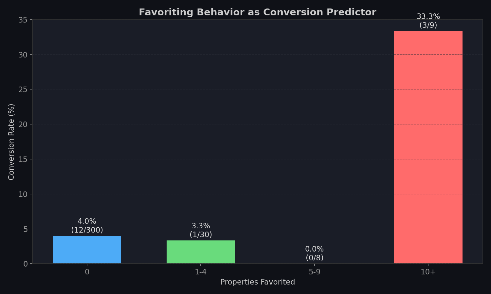

Contacts who have favorited **10+ properties** convert to Active Client/Closed/Under Contract at **33.3%** (3 of 9). Contacts with 0 favorites convert at just **4.0%** (12 of 300).

That is an **8.3x difference** in conversion rate. Favoriting is the strongest single behavioral predictor of conversion in the dataset.

Why does this make sense? Favoriting is a deliberate action. It requires the buyer to evaluate a property and consciously save it. Unlike page views (which can be casual browsing), favorites represent narrowing intent. When someone is saving properties, they are mentally building a shortlist.

**Recommendation:** Weight the `intent_high_favorites` flag more heavily in priority scoring. Consider triggering an automatic action plan when a contact crosses 5 favorites.

### Insight 3: Price Tier Reveals Buyer Seriousness

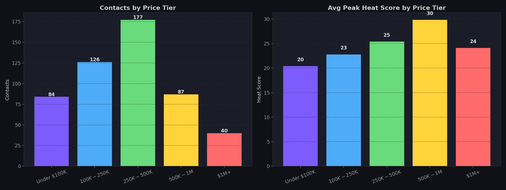

| Price Tier | Contacts | Avg Peak Heat |
|-----------|----------|--------------|
| Under $100K | 29 | 54.6 |
| $100K-$250K | 72 | 50.2 |
| $250K-$500K | 55 | 44.9 |
| $500K-$1M | 22 | 33.4 |
| $1M+ | 5 | 40.4 |

The under-$100K tier has the highest average heat. This cohort is actively searching in volume, likely because inventory at that price point is scarce in WNC, so they browse more listings trying to find something. The $500K-$1M tier shows lower heat but higher intent per interaction.

**The breakthrough:** Cross-reference price tier with call activity. The under-$100K searchers may be investors or land buyers who respond better to targeted property packages than phone calls. The $250K-$500K tier is the sweet spot for traditional buyer conversion and should get priority phone attention.

### Insight 4: The Kevin Lewis Blueprint

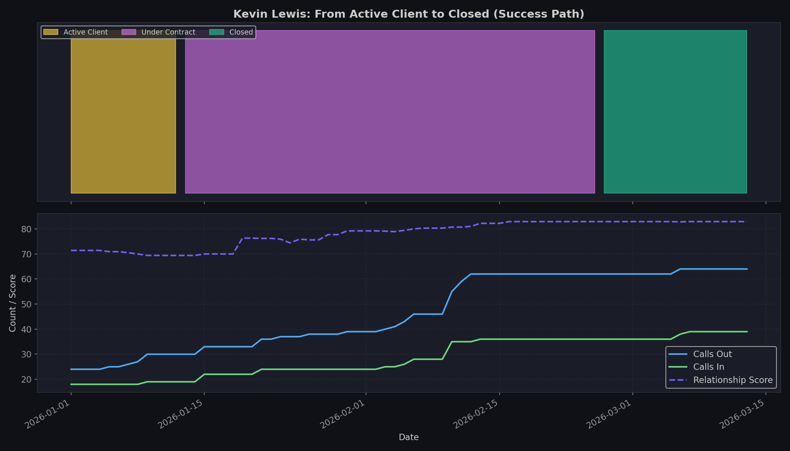

Kevin Lewis is the only contact in the dataset who traveled the full path: Active Client, Under Contract, Closed. His journey is a blueprint for what works:

- **Zero website activity.** No property views, no favorites, no website visits. Kevin was not an IDX lead.
- **103 total calls** (64 outbound, 39 inbound). This is a relationship built entirely on communication.
- **Relationship score climbed steadily** from 69 to 83 over the period.
- **Heat score held at 100** throughout, driven entirely by the call volume, not digital activity.

The lesson: Kevin's deal closed because of persistent, consistent phone contact. The scoring system correctly identified him via relationship score, not heat. This validates the three-score model (Heat + Value + Relationship), but also shows that the system needs to weigh relationship score more heavily in the priority calculation for contacts who show call-based engagement patterns rather than digital ones.

### Insight 5: Communication Gap Is Costing Deals

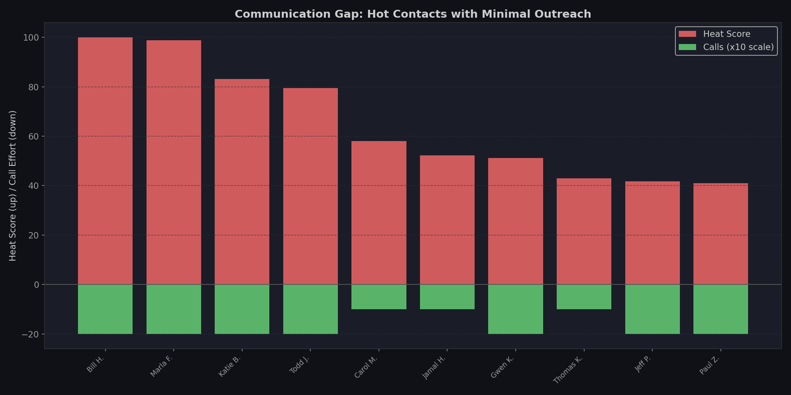

**10 contacts currently have heat scores above 40 and fewer than 2 calls logged.** These are active searchers who the team has barely contacted:

| Contact | Heat | Props Viewed | Visits | Calls | Avg Price |
|---------|------|-------------|--------|-------|-----------|
| Bill Hollenbeck | 100 | 203 | 28 | 2 | $94K |
| Marla Foit | 98.8 | 72 | 56 | 2 | $96K |
| Katie Boggs | 83.1 | 43 | 40 | 2 | $233K |
| Todd Jensen | 79.5 | 196 | 78 | 2 | $315K |
| Carol Mayberry | 58.0 | 66 | 47 | 1 | $244K |
| Jamal Hammett | 52.3 | 102 | 27 | 1 | $863K |
| Gwen Keough | 51.2 | 80 | 25 | 2 | $223K |

**Jamal Hammett** stands out: browsing at an average price of $863K with only 1 call. A single high-end transaction here could represent $20K+ in commission.

---

## Part 6: Recommendations

### Immediate Actions (This Week)

1. **Call the Silent Buyers.** Start with the 15 zero-call contacts who have 30+ property views. Prioritize by avg_price_viewed. Even converting 1-2 of these would justify the effort many times over.

2. **Close the Communication Gap.** The 10 contacts with heat > 40 and fewer than 2 calls need follow-up. Prioritize Todd Jensen ($315K avg), Jamal Hammett ($863K avg), and Katie Boggs ($233K avg).

3. **Investigate Christopher Graney.** 1,684 property views is an outlier by 10x. Either this is a power user who should be called immediately, or it's bot/automated traffic that should be filtered from scoring.

### System Improvements (Next 2 Weeks)

4. **Build "Silent Buyer" alerts** into the call list. Trigger when: properties_viewed > 20 AND heat_score > 50 AND total_calls = 0.

5. **Recalibrate value scoring.** Under Contract contacts should not score 0 on value. The model should factor in avg_price_viewed and stage.

6. **Add favorites-weighted priority boost.** Contacts with 5+ favorites should receive a priority score bump proportional to their favoriting intensity.

7. **Create a "Heat Decay" watchlist.** Contacts whose heat dropped more than 30 points in the last 14 days should surface on a re-engagement list.

### Strategic (Next Month)

8. **Segment outreach by price tier.** Under-$100K searchers may respond better to curated property packages. $250K-$500K should get priority phone outreach. $500K+ should get white-glove treatment with personalized market updates.

9. **Track "time to first call"** as a new metric. The data strongly suggests that speed of first contact correlates with conversion. Measuring this would let us set SLA targets.

10. **Build a conversion prediction model.** The snapshot data now provides enough history to train a simple classifier: given current heat, favorites count, visit count, days since registration, and calls logged, predict probability of advancing to Active Client. This could replace the hand-tuned scoring weights with data-driven ones.

---

## Appendix: Data Quality Notes

- **sync_id is always 0.** The migration from Sheets did not preserve sync batch IDs. Future syncs will populate this correctly.
- **texts_total is 0 across all records.** Either text tracking is not enabled in FUB, or the Sheets export did not include it. This is a blind spot; text communication is likely significant and unmeasured.
- **Feb 10-12 contact spike.** 300+ additional contacts appeared for 3 days then disappeared. This was likely a sync configuration change that briefly pulled in a wider contact set. The core ~450 contacts are consistent.
- **Heat score calculation.** The abrupt cliff-drops in heat trajectories suggest a time-decay function that resets sharply rather than degrading smoothly. Consider whether a gentler decay curve would better represent sustained (but intermittent) interest.

---

*Report generated March 13, 2026*
*Data source: contact_snapshots table (92,861 rows, 898 unique contacts)*
*Charts: reports/snapshot_analysis/*
